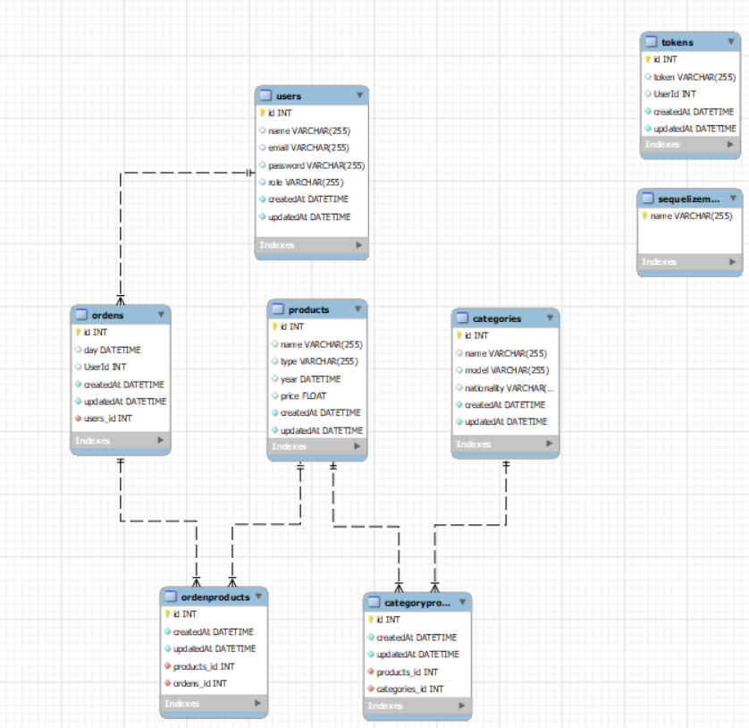
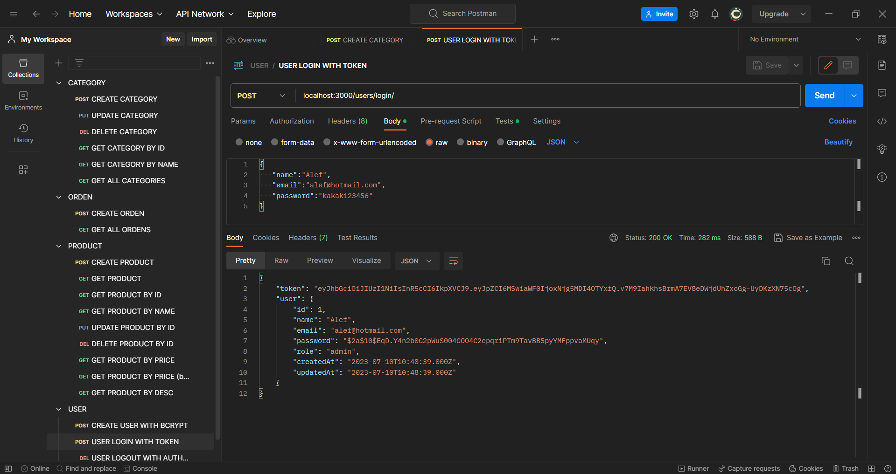

<h1 align="center"> First Project - E-commerce</h1>

 <h2 align="center">BACKEND PROJECT</h2>
 <h4 align="center">REST API </h4>

  <p align="center">
    E-commerce made using Javascript and MySQL database.
    <br />
    <a href="https://github.com/victorcodigos/1-proyecto-e-commerce-backend"><strong>Explore the docs »</strong></a>
    <br />
    ·
    <a href="https://github.com/victorcodigos/1-proyecto-e-commerce-backend/issues">Report Bug</a>
    ·
    <a href="https://github.com/victorcodigos/1-proyecto-e-commerce-backend/issues">Request Feature</a>
  </p>
</div>

# <h1 align="center"> ⚙️ Description | Development 🔧 </h1>

For this project I have made a diagram creating different tables and the relationship between them (1:N, N:M, N:M).

#  🧑‍💻 Also, I have created a REST API capable of the following points:

- User login + logout. Token (JWT) + middleware.
- Creation of a CRUD.
- User registration using Bcrypt.
- At least one Many to Many relationship and another One to Many.
- Use of seeders.

# Diagram


##### User:Orders have a (1:N) relationship since a user can have several orders but an order can only belong to one user.

##### Orders:Products had a relationship of (N:M) so an intermediate table was created, and automatically the two Foreing Key remain in the mentioned tables

##### Products:Categories had a relationship of (N:M) so an intermediate table was created, and automatically the two Foreing Key remain in the mentioned tables.

- Below I have an example

<h1 aligh="center"> </h1> 

<h1>
   </img>
  
  </h1> 


### Built with :


##  👩‍💻 How to download the project 

```bash
 # Clone the repository
 $ git clone https://github.com/victorcodigos/1-proyecto-e-commerce-backend
 
 # Enter the directory
 $ cd 1-proyecto-e-commerce-backend

 # Install the dependencies
 $ npm install

 # start or project
 $ npm start 

```

# <h1 align="center"> 🎯 Using the Postman to testing the REST API 🖥️  </h1>

<h1 aligh="center"> </h1> 

<h1>
   </img>
  
  </h1> 


## Future Roadmap

- [ ] Add a different style
- [ ] Add more products
- [ ] Add reviews


## Contributing

Contributions are what make the open source community such an amazing place to learn, inspire, and create. Any contributions you make are **greatly appreciated**.

If you have a suggestion that would make this better, please fork the repo and create a pull request. You can also simply open an issue with the tag "enhancement".
Don't forget to give the project a star! Thanks again!

1. Fork the project
2. Create your feature Branch (`git checkout -b feature/YourName`)
3. Commit your changes (`git commit -m 'Add some YourName`)
4. Push to the branch (`git push origin feature/YourName`)
5. Open a pull request.


### 📫 How to reach me:


<a href="https://www.linkedin.com/in/victor-macedo-4a8901210/" target="_blank"></a>

📩 Or if you want to send me an email: **victor.macedo.dedeus@gmail.com**

